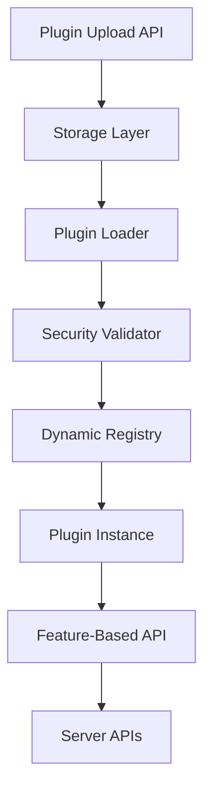

# Dynamic Plugin System with .so Files

## Architecture Overview




## 1. Core Plugin Interfaces - Feature-Based API

**Create**: `internal/plugin_sdk/interfaces.go`

- Define `APIVersion` constant (e.g., "v1.0.0")
- Define `PluginSDK` interface with minimum required methods:
- `GetManifest() PluginManifest` - Returns plugin metadata + feature declarations
- `Initialize(baseAPI BaseAPI) error` - Receives only base API
- `Shutdown() error`
- Define `PluginManifest` struct:
- `ID`, `Name`, `Version`, `Author`, `SDKVersion` (required)
- `RequiredFeatures []FeatureID` - Features this plugin needs
- `ProvidedFeatures []FeatureID` - Features this plugin implements
- `RequiredPermissions []PermissionID`
- `Signature []byte` - Plugin signature
- Define feature IDs as constants:
- `FeatureEventHandling`, `FeatureRCON`, `FeatureDatabaseAccess`
- `FeatureCommands`, `FeatureConnectors`, `FeatureAdminAPI`
- Each feature maps to an optional API interface

**Why**: This allows adding new features (e.g., `FeatureMetrics`) without breaking old plugins that don't declare support for it.

## 2. Feature Gateway System

**Create**: `internal/plugin_sdk/feature_gateway.go`

- `FeatureGateway` struct manages API access per plugin
- `GetFeatureAPI(featureID FeatureID) (interface{}, error)` - Returns API only if plugin declared support
- Feature-to-API mappings:
- `FeatureEventHandling` → `EventAPI` interface
- `FeatureRCON` → `RconAPI` interface
- `FeatureDatabaseAccess` → `DatabaseAPI` interface
- Enforces that plugins can't access APIs for undeclared features

## 3. Plugin Loader with Security

**Create**: `internal/plugin_loader/loader.go`

- `LoadPlugin(ctx context.Context, pluginPath string) (*LoadedPlugin, error)`
- Uses Go's `plugin.Open(pluginPath)` to load .so file
- Looks up exported symbol: `var PluginExport PluginSDK`
- Returns `LoadedPlugin` wrapping the plugin instance
- `ValidatePlugin(manifest PluginManifest) error`
- Verify signature using public key registry
- Check SDK version compatibility
- Validate required features exist in current version
- `UnloadPlugin(pluginID string) error`
- Note: Go plugins can't be truly unloaded, document this limitation
- Release resources, mark as inactive

**Create**: `internal/plugin_loader/signature.go`

- `VerifySignature(pluginBytes []byte, signature []byte, publicKey []byte) error`
- Use Ed25519 or RSA for signing
- Store trusted public keys in database

**Create**: `internal/plugin_loader/sandbox.go`

- `SandboxConfig` struct with limits:
- `MaxMemoryMB`, `MaxGoroutines`, `CPUTimeLimit`
- Use runtime metrics to monitor plugin resource usage
- Implement goroutine tracking via custom goroutine spawner in BaseAPI

## 4. Storage Integration

**Update**: [`internal/storage/storage.go`](internal/storage/storage.go)

- Plugin files stored at path: `plugins/{plugin_id}/{version}/{plugin_id}.so`
- Leverage existing `Storage` interface for upload/download
- Support both local filesystem and S3

**Create**: `internal/plugin_manager/plugin_storage.go`

- `SavePlugin(ctx context.Context, pluginID, version string, reader io.Reader) error`
- `LoadPlugin(ctx context.Context, pluginID, version string) (io.ReadCloser, error)`
- `DeletePlugin(ctx context.Context, pluginID, version string) error`
- `ListPluginVersions(ctx context.Context, pluginID string) ([]string, error)`

## 5. Database Schema

**Create**: Migration file for plugin metadata

```sql
CREATE TABLE custom_plugins (
    id UUID PRIMARY KEY,
    plugin_id VARCHAR(255) UNIQUE NOT NULL,
    name VARCHAR(255) NOT NULL,
    version VARCHAR(50) NOT NULL,
    author VARCHAR(255),
    sdk_version VARCHAR(20),
    storage_path TEXT,
    signature BYTEA,
    uploaded_by UUID REFERENCES users(id),
    uploaded_at TIMESTAMP DEFAULT NOW(),
    required_features TEXT[], -- JSON array of feature IDs
    provided_features TEXT[],
    required_permissions TEXT[],
    enabled BOOLEAN DEFAULT FALSE,
    verified BOOLEAN DEFAULT FALSE
);

CREATE TABLE plugin_permissions (
    id UUID PRIMARY KEY,
    plugin_id UUID REFERENCES custom_plugins(id) ON DELETE CASCADE,
    permission_id VARCHAR(100) NOT NULL,
    granted_by UUID REFERENCES users(id),
    granted_at TIMESTAMP DEFAULT NOW()
);

CREATE TABLE plugin_public_keys (
    id UUID PRIMARY KEY,
    key_name VARCHAR(255) NOT NULL,
    public_key BYTEA NOT NULL,
    algorithm VARCHAR(50) NOT NULL,
    added_by UUID REFERENCES users(id),
    added_at TIMESTAMP DEFAULT NOW(),
    revoked BOOLEAN DEFAULT FALSE
);
```


## 6. Plugin Manager Updates

**Update**: [`internal/plugin_manager/plugin_manager.go`](internal/plugin_manager/plugin_manager.go)

- Add `customPlugins map[string]*LoadedPlugin `alongside existing `plugins`
- `LoadCustomPlugin(ctx context.Context, pluginID string) error`
- Download .so from storage
- Write to temporary directory (e.g., `/tmp/squad-aegis-plugins/`)
- Load using `plugin_loader.LoadPlugin()`
- Validate signature and features
- Check permissions
- Register in dynamic registry
- `CreateCustomPluginInstance(serverID, pluginID, instanceID, config)` 
- Similar flow to existing `CreatePluginInstance` but uses loaded .so plugin
- Maintain backward compatibility: built-in plugins still work via existing code path

**Create**: `internal/plugin_manager/dynamic_registry.go`

- Extends `PluginRegistry` interface to support runtime-loaded plugins
- `RegisterLoadedPlugin(loadedPlugin *LoadedPlugin) error`
- `GetPluginSource(pluginID string) PluginSource` - Returns "builtin" or "custom"

## 7. Security & Permission System

**Create**: `internal/plugin_security/permissions.go`

- Define permission constants:
- `PermissionRCONAccess`, `PermissionDatabaseRead`, `PermissionDatabaseWrite`
- `PermissionKickPlayers`, `PermissionBanPlayers`, `PermissionAdminManagement`
- `CheckPermission(pluginID, permissionID) bool`
- Permission denied → return error from API call

**Create**: `internal/plugin_security/sandbox.go`

- `PluginSandbox` wraps plugin instances
- Monitors resource usage via:
- `runtime.MemStats` for memory
- Custom goroutine counter (increment on spawn, decrement on exit)
- `time.AfterFunc` for timeout enforcement
- `EnforceLimits()` - Kill plugin if limits exceeded

## 8. API Endpoints

**Create**: `internal/server/plugin_upload.go`

- `POST /api/v1/plugins/upload` - Upload .so file with metadata
- Multipart form: `file`, `manifest` (JSON)
- Validates file is valid .so
- Stores in storage backend
- Creates database entry
- Returns plugin ID
- `GET /api/v1/plugins` - List all plugins (builtin + custom)
- `GET /api/v1/plugins/:id/versions` - List versions of a plugin
- `DELETE /api/v1/plugins/:id` - Delete custom plugin
- `POST /api/v1/plugins/:id/verify` - Admin verifies plugin signature
- `GET /api/v1/plugins/:id/permissions` - Get required permissions
- `POST /api/v1/plugins/:id/permissions/grant` - Grant permissions

**Create**: `internal/server/plugin_keys.go`

- `POST /api/v1/plugins/keys` - Upload public key for signature verification
- `GET /api/v1/plugins/keys` - List public keys
- `DELETE /api/v1/plugins/keys/:id` - Revoke public key

## 9. Building Custom Plugins

**Create**: `examples/custom_plugin/` directory with example plugin

- `plugin.go` - Implements `PluginSDK` interface
- `Makefile` - Builds plugin as .so:
  ```makefile
      build:
        go build -buildmode=plugin -o example.so plugin.go
  ```


- `README.md` - Documentation for plugin developers
- Example manifest declaration showing feature requirements

**Create**: `docs/content/docs/plugins/custom-plugins.md`

- Guide for developing custom plugins
- Explain feature system
- Show how to build and sign plugins
- Security best practices

## 10. Testing Strategy

**Create**: `internal/plugin_loader/loader_test.go`

- Test loading valid .so files
- Test signature verification (valid/invalid)
- Test feature validation
- Test sandbox enforcement

**Create**: `examples/test_plugins/` directory

- Create multiple test .so files with different feature requirements
- Signed and unsigned versions
- Malformed plugins for error testing

## Implementation Phases

### Phase 1: SDK & Interfaces

- Define `plugin_sdk` package with feature-based interfaces
- Create `FeatureGateway` system
- Update existing plugins to optionally support new SDK (for testing)

### Phase 2: Plugin Loader

- Implement .so loading mechanism
- Add signature verification
- Build sandbox monitoring

### Phase 3: Storage & Database

- Add database migrations
- Integrate with storage system
- Create plugin storage management

### Phase 4: Security Layer

- Implement permission system
- Add resource sandboxing
- Create public key management

### Phase 5: API & UI

- Build upload/management endpoints
- Create web UI for plugin upload
- Add permission grant UI

### Phase 6: Documentation & Examples

- Write developer guide
- Create example plugins
- Document migration path for existing plugins

## Migration Path for Existing Built-in Plugins

Two-phase coexistence:

1. **Short term**: Built-in plugins continue to work via existing interfaces
2. **Long term**: Optionally rebuild built-in plugins as .so files for consistency

Built-in plugins can be flagged with `PluginSource: "builtin"` vs `"custom"` in the registry.

## Security Considerations

- **Signature verification**: All custom plugins must be signed with trusted keys
- **Permission granularity**: Plugins explicitly request permissions; admins grant them
- **Resource limits**: Memory, goroutines, and CPU time enforced via sandbox
- **Audit logging**: All plugin actions logged to ClickHouse
- **Code review**: Recommend manual code review before enabling custom plugins
- **Isolation**: Plugins can't access host filesystem directly (only via Storage API)

## Backward Compatibility

- Old built-in plugins continue working unchanged
- New plugins declare `sdk_version` in manifest
- System checks `sdk_version` compatibility before loading