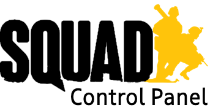
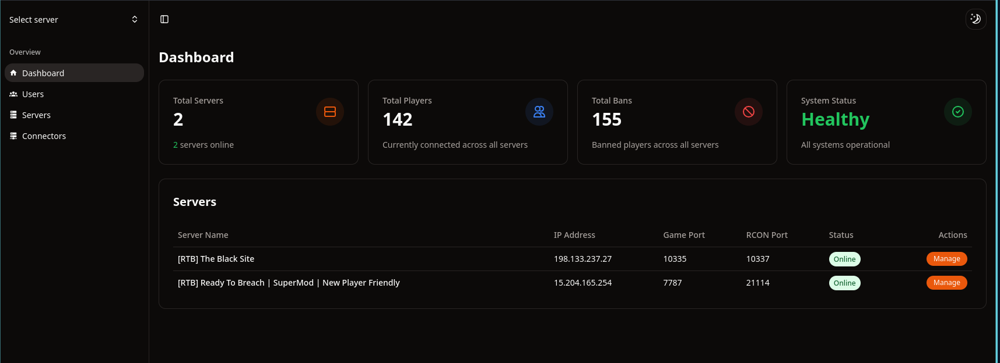

<div align="center">



# Squad Aegis

A comprehensive control panel for Squad game server administration

</div>

## Notice

The project is currently in the early stages of development and is not ready for production use. Expect breaking changes and bugs as I work on making this stable and not a bunch of ai written spaghetti code from the PoC.

## Overview

**Squad Aegis** is an all-in-one control panel designed to manage multiple Squad game servers efficiently. Whether you're running a single server or a complex cluster, Squad Aegis provides a centralized interface to keep everything under control. Built with a robust Go backend, a sleek Nuxt 3 frontend, and a reliable PostgreSQL database, it is tailored to offer:

- **Centralized Server Management**: Seamlessly manage numerous Squad game servers from a unified dashboard.
- **Role-Based Access Control**: Establish granular permissions to secure server operations.
- **RCON Command Interface**: Send RCON commands directly via an intuitive web UI.
- **Comprehensive Audit Logging**: Keep a detailed record of all administrative actions for accountability.

## Acknowledgments

- [milutinke/sqcp](https://github.com/milutinke/sqcp): This project draws inspiration sqcp and we extend gratitude to the Squad gaming community for their support and feedback.
- [SquadGO/squad-rcon-go](https://github.com/SquadGO/squad-rcon-go): For the RCON library used in this project with some modifications of our own to suit our needs.
- [Team-Silver-Sphere/SquadJS](https://github.com/Team-Silver-Sphere/SquadJS/tree/v4.2.0): Big thanks to Team Silver Sphere for their SquadJS project which provided a solid foundation for our log parsing logic along plenty of designs for plugins! We do our best to be feature compat with SquadJS to make a easy and simple switch.

## Features

### Core Features

- **Multi-Server Management**: Central hub allowing supervision and control of multiple servers from a single interface.
- **Role-Based Access**: Define specific permissions for users to ensure only authorized actions are executed.
- **RCON Interface**: Engage with server commands using a user-friendly web-based interface.
- **Audit System**: Detailed logging of administrative activities for transparency and security.

## Installation Guide

To set up **Squad Aegis**, you'll need to install certain prerequisites and configure the environment correctly. Follow the steps below for a successful installation:

### Prerequisites

Ensure you have the following installed on your system:

- **Docker Engine** 20.10.0 or newer: Container platform to deploy the application.
- **Docker Compose V2**: Tool for defining and running multi-container Docker applications.
- Minimum **2GB RAM**: For efficient performance.
- At least **10GB available storage**: To store data and logs.

### Quick Start (Using Docker)

Follow these concise steps to quickly deploy Squad Aegis using Docker:

1. **Create a new directory and download the docker-compose file** to begin the installation:

```bash
mkdir squad-aegis && cd squad-aegis
LATEST_TAG=$(curl -s https://api.github.com/repos/Codycody31/squad-aegis/releases/latest | jq -r '.tag_name')
curl -O https://raw.githubusercontent.com/Codycody31/squad-aegis/$LATEST_TAG/docker-compose.yml
```

2. **Configure the dashboard environment** by creating a `.env` file with the environment variables specified below:

```yaml
environment:
  - INITIAL_ADMIN_USERNAME=your_admin_username
  - INITIAL_ADMIN_PASSWORD=your_secure_password
  - APP_URL=http://your_domain_or_ip:3113
  - DB_HOST=database
  - DB_PORT=5432
  - DB_NAME=squad-aegis
  - DB_USER=squad-aegis
  - DB_PASS=squad-aegis
```

3. **Start the services** using the docker compose:

```bash
docker compose up -d
```

4. **Access the dashboard**: Once the servers start, visit `http://localhost:3113` to access your control panel.

### Log Watcher Setup

To monitor Squad server logs in real-time, set up the Log Watcher component:

1. **Create a separate directory and download the Log Watcher docker-compose file**:

```bash
mkdir squad-aegis-log-watcher && cd squad-aegis-log-watcher
LATEST_TAG=$(curl -s https://api.github.com/repos/Codycody31/squad-aegis/releases/latest | jq -r '.tag_name')
curl -O https://raw.githubusercontent.com/Codycody31/squad-aegis/$LATEST_TAG/docker-compose.logwatcher.yml
```

2. **Configure the Log Watcher environment** to suit your logging requirements:

```yaml
environment:
  - LOGWATCHER_PORT=31135
  - LOGWATCHER_AUTH_TOKEN=your_secure_token  # Must match dashboard configuration
  - LOGWATCHER_SOURCE_TYPE=local             # Options: local, sftp, ftp
  - LOGWATCHER_LOG_FILE=/path/to/SquadGame.log
  - LOGWATCHER_READ_FROM_START=false         # Set true to read entire log history
```

3. **Start the Log Watcher**:

```bash
docker compose -f docker-compose.logwatcher.yml up -d
```

By default, the Log Watcher broadcasts new log entries from the point it starts, akin to `tail -f`. To process entire log data, adjust `LOGWATCHER_READ_FROM_START`.

## Configuration

### Essential Environment Variables

For optimal configuration, make note of these essential variables:

#### Core Application

| Variable | Description | Default |
|----------|-------------|---------|
| APP_PORT | Dashboard web port | 3113 |
| APP_URL | The public URL of the application | <http://localhost:3113> |
| INITIAL_ADMIN_USERNAME | First admin user | admin |
| INITIAL_ADMIN_PASSWORD | Initial admin password | admin |

#### Database Connection

| Variable | Description | Default |
|----------|-------------|---------|
| DB_HOST | PostgreSQL database host | database |
| DB_PORT | PostgreSQL connection port | 5432 |
| DB_NAME | Database name | squad-aegis |
| DB_USER | Database user | squad-aegis |
| DB_PASS | Database password | squad-aegis |

## Development

For those interested in development, utilize the development compose file to set up the environment:

```bash
docker compose -f docker-compose.dev.yml up -d
```

## Screenshots



## Contributing

We welcome contributions!

## Support

For help and support, you can refer to the resources below:

- **Issue Tracker**: [Submit bug reports and feature requests](https://github.com/Codycody31/squad-aegis/issues)

## License

This project is available under the [Apache 2.0 License](LICENSE).

Ensure to check directories for any additional licenses or third-party components.
