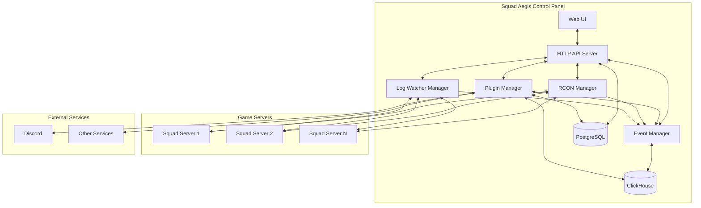
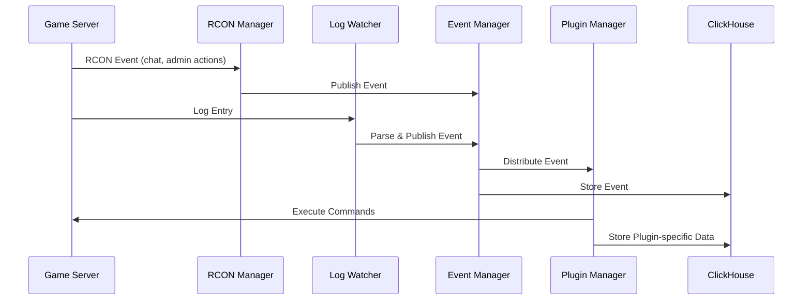
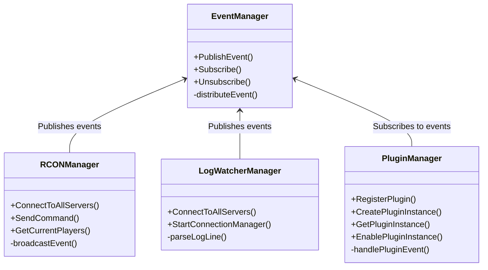
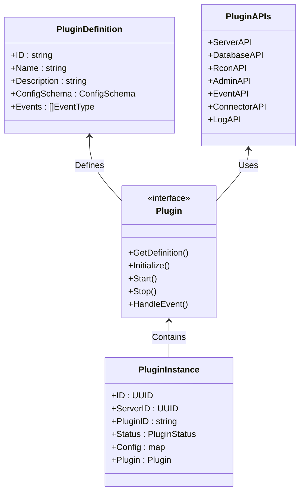
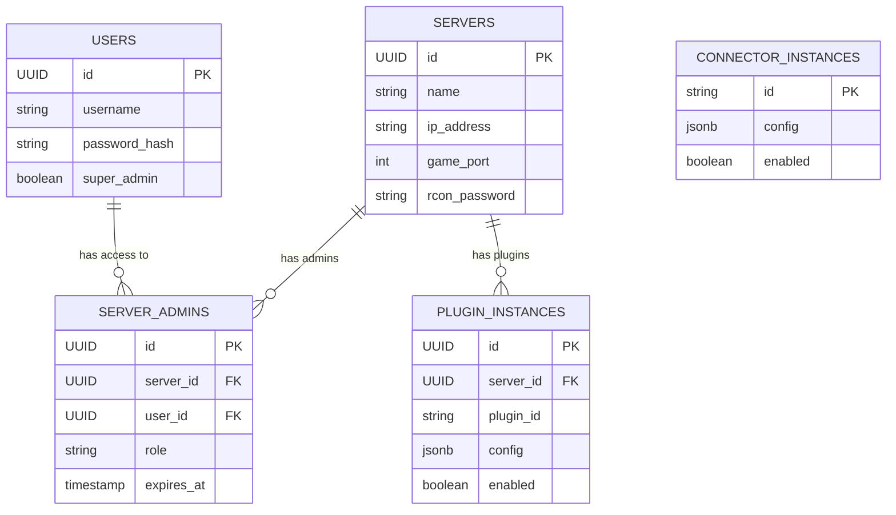
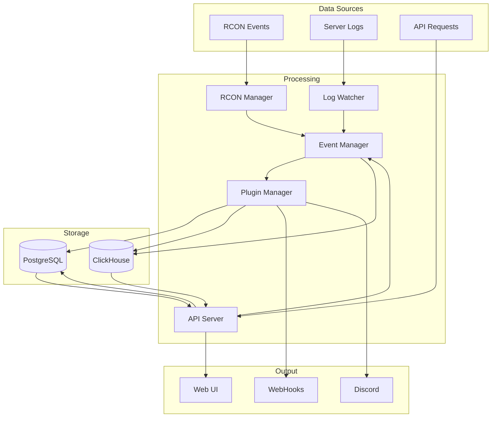
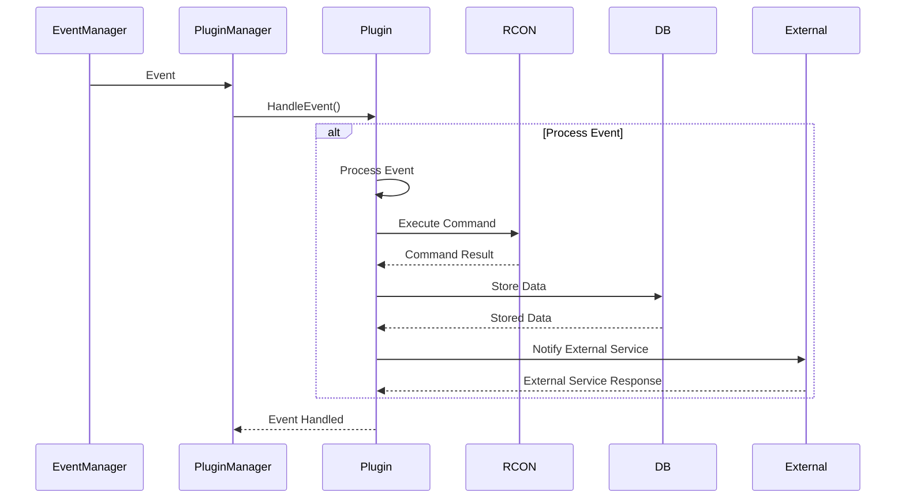
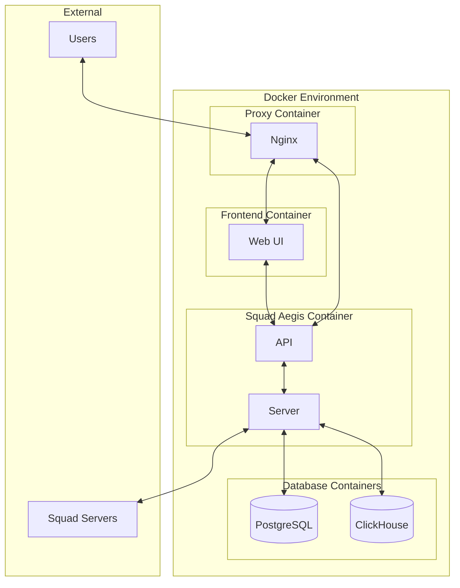

This page provides a detailed overview of Squad Aegis architecture with visual diagrams to help understand the data flow and component interactions.

## System Overview

Squad Aegis follows a modular architecture where different components interact through well-defined interfaces. The system is designed to be extensible through plugins while maintaining a stable core.

## Event Flow

Events are at the heart of Squad Aegis. The event system follows a publish-subscribe pattern, allowing components to emit events that other components can react to.

## Component Architecture

### Core Components

The core of Squad Aegis consists of several managers that handle different aspects of the system.

### Plugin System

The plugin system allows for extending functionality without modifying the core codebase.

### Database Architecture

Squad Aegis uses two database systems: PostgreSQL for relational data and ClickHouse for analytics.

## Data Flow

This diagram shows how data flows through the system from various sources to the end user.

## Plugin Data Flow

This diagram illustrates how data flows through a plugin from receiving an event to taking actions.

## Deployment Architecture

Squad Aegis is designed to be deployed using Docker containers, making it easy to set up and maintain.

## Development Considerations

When developing for Squad Aegis, keep these architectural principles in mind:

1. **Event-Driven Design**: Most functionality is triggered by events. New features should integrate with the event system.

2. **Modularity**: Keep components modular and with well-defined interfaces.

3. **Plugin Extensibility**: When possible, implement new features as plugins rather than modifying core code.

4. **Scalability**: The system should handle multiple servers and high event volumes efficiently.

5. **Security**: Be mindful of security considerations, especially in the RCON and API components.

By understanding these diagrams and principles, developers can effectively contribute to and extend Squad Aegis.
