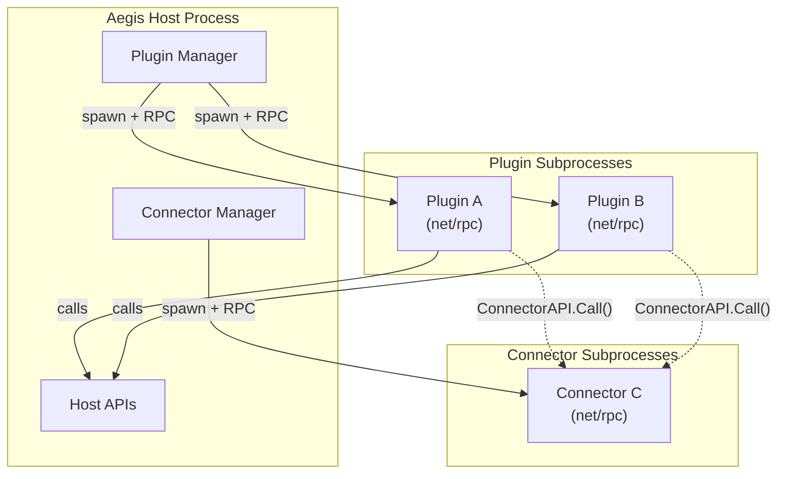
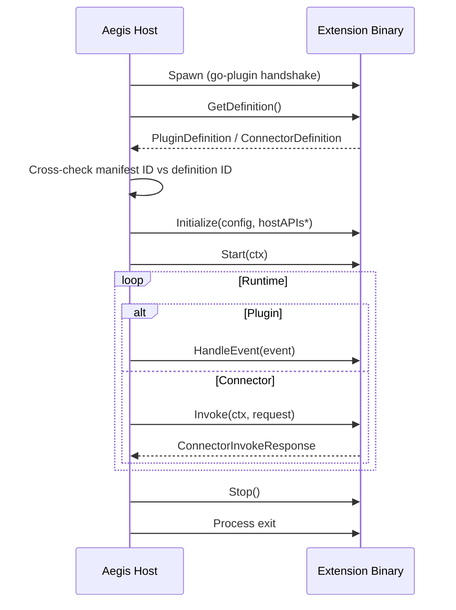

Squad Aegis native extensions are standalone Go binaries that run as isolated subprocesses. The host launches them via [hashicorp/go-plugin](https://github.com/hashicorp/go-plugin), communicates over net/rpc, and tears them down cleanly on shutdown. A crash in your extension cannot corrupt the host.

There are two extension types:

- **Plugin** - runs against a specific game server. It subscribes to events (chat, kills, connections, system signals), reacts to them, and calls host APIs such as RCON, logging, rules, admin, database, Discord, and connectors.
- **Connector** - a reusable service that exposes a request/response `Invoke` entrypoint. Plugins call connectors when they need shared logic or access to an external system. Connectors do not receive host APIs or events.

### Which should I build?

| Build a | When you need | Example |
| --- | --- | --- |
| Plugin | Per-server automation driven by game events or host APIs | Chat moderation, kick/ban enforcement, Discord relay, player tracking |
| Connector | A shared service that multiple plugins (or external tools) can call | External API wrapper, centralized integration logic, data enrichment service |
| Both | An integration boundary and per-server behavior that uses it | A connector for an external ban list + a plugin that checks it on player join |

Both ship as a zip bundle containing a `manifest.json` and one or more Linux binaries.

---

## Architecture



Key invariants:

- **Process isolation.** Each extension runs in its own OS process. The host monitors health and restarts as needed.
- **Manifest vs. definition split.** The `manifest.json` carries identity and trust data (name, version, authors, signature, checksums). The binary's `GetDefinition()` returns runtime behavior (config schema, events, connector dependencies). The host cross-checks the ID from both - a mismatch rejects the bundle.
- **Plugins call connectors, not the reverse.** A plugin reaches a connector through `ConnectorAPI.Call()`. Connectors never import plugin code.

---

## Extension Lifecycle



\* Connectors do not receive `hostAPIs`.

Both extension types share the same set of status values:

| Status | Meaning |
| --- | --- |
| `stopped` | Not running |
| `starting` | Initializing |
| `running` | Healthy and processing |
| `stopping` | Shutting down |
| `error` | Failed - check logs |
| `disabled` | Manually disabled by operator |

---

## Quickstart

**Working inside this repository:**

```bash
# Read the checked-in examples
examples/native-plugin-hello/main.go
examples/native-connector-hello/main.go

# Build + package
./scripts/package-example-native-plugin.sh
./scripts/package-example-native-connector.sh
```

**Building an external extension:**

```bash
mkdir my-aegis-extension && cd my-aegis-extension
go mod init example.com/my-aegis-extension
go get go.codycody31.dev/squad-aegis@latest
```

Import only the public SDK packages:

- `go.codycody31.dev/squad-aegis/pkg/pluginrpc` for plugins
- `go.codycody31.dev/squad-aegis/pkg/connectorrpc` for connectors

---

## Building a Plugin

### The Plugin Interface

Your binary must implement `pluginrpc.Plugin`:

```go
type Plugin interface {
    GetDefinition() PluginDefinition
    Initialize(config map[string]interface{}, apis *HostAPIs) error
    Start(ctx context.Context) error
    Stop() error
    HandleEvent(event *PluginEvent) error
    GetStatus() PluginStatus
    GetConfig() map[string]interface{}
    UpdateConfig(config map[string]interface{}) error
    GetCommands() []PluginCommand
    ExecuteCommand(commandID string, params map[string]interface{}) (*CommandResult, error)
    GetCommandExecutionStatus(executionID string) (*CommandExecutionStatus, error)
}
```

| Method | Role |
| --- | --- |
| `GetDefinition` | Return runtime behavior: config schema, subscribed events, connector dependencies |
| `Initialize` | Receive config and host API handles. Set up internal state |
| `Start` | Begin processing. Return immediately unless the plugin is long-running |
| `Stop` | Clean up resources and background goroutines |
| `HandleEvent` | React to a subscribed event. Keep this fast - offload heavy work |
| `GetStatus` | Report current lifecycle status |
| `GetConfig` / `UpdateConfig` | Read and hot-reload configuration |
| `GetCommands` | Declare operator-invocable commands (or return `nil`) |
| `ExecuteCommand` | Run a declared command synchronously or start it asynchronously |
| `GetCommandExecutionStatus` | Poll progress of an async command |

### Minimal Example

A plugin that responds to a chat command with a private warning message:

```go
package main

import (
    "context"
    "encoding/json"
    "fmt"
    "strings"
    "sync"

    pluginrpc "go.codycody31.dev/squad-aegis/pkg/pluginrpc"
)

type chatMessage struct {
    SteamID    string `json:"steam_id,omitempty"`
    EOSID      string `json:"eos_id,omitempty"`
    PlayerName string `json:"player_name,omitempty"`
    Message    string `json:"message,omitempty"`
}

type helloPlugin struct {
    mu     sync.Mutex
    config map[string]interface{}
    apis   *pluginrpc.HostAPIs
    status pluginrpc.PluginStatus
}

func main() {
    pluginrpc.Serve(&helloPlugin{})
}

func (p *helloPlugin) GetDefinition() pluginrpc.PluginDefinition {
    return pluginrpc.PluginDefinition{
        PluginID: "com.example.plugins.hello",
        ConfigSchema: pluginrpc.ConfigSchema{
            Fields: []pluginrpc.ConfigField{
                {
                    Name:        "trigger",
                    Description: "Chat command that triggers the response.",
                    Type:        pluginrpc.FieldTypeString,
                    Default:     "!hello",
                },
                {
                    Name:        "response",
                    Description: "Message sent back to the player.",
                    Type:        pluginrpc.FieldTypeString,
                    Default:     "Hello from Squad Aegis.",
                },
            },
        },
        Events: []string{"RCON_CHAT_MESSAGE"},
    }
}

func (p *helloPlugin) Initialize(config map[string]interface{}, apis *pluginrpc.HostAPIs) error {
    p.mu.Lock()
    defer p.mu.Unlock()
    p.config = config
    p.apis = apis
    p.status = pluginrpc.PluginStatusStopped
    return nil
}

func (p *helloPlugin) Start(context.Context) error {
    p.mu.Lock()
    defer p.mu.Unlock()
    p.status = pluginrpc.PluginStatusRunning
    return nil
}

func (p *helloPlugin) Stop() error {
    p.mu.Lock()
    defer p.mu.Unlock()
    p.status = pluginrpc.PluginStatusStopped
    return nil
}

func (p *helloPlugin) HandleEvent(event *pluginrpc.PluginEvent) error {
    if event == nil || event.Type != "RCON_CHAT_MESSAGE" {
        return nil
    }

    var msg chatMessage
    if err := json.Unmarshal(event.Data, &msg); err != nil {
        return fmt.Errorf("decode chat event: %w", err)
    }

    p.mu.Lock()
    trigger := fmt.Sprint(p.config["trigger"])
    response := fmt.Sprint(p.config["response"])
    apis := p.apis
    p.mu.Unlock()

    if !strings.EqualFold(strings.TrimSpace(msg.Message), trigger) {
        return nil
    }

    playerID := msg.EOSID
    if playerID == "" {
        playerID = msg.SteamID
    }

    if apis != nil && apis.RconAPI != nil {
        return apis.RconAPI.SendWarningToPlayer(playerID, response)
    }
    return nil
}

func (p *helloPlugin) GetStatus() pluginrpc.PluginStatus {
    p.mu.Lock()
    defer p.mu.Unlock()
    return p.status
}

func (p *helloPlugin) GetConfig() map[string]interface{} {
    p.mu.Lock()
    defer p.mu.Unlock()
    return p.config
}

func (p *helloPlugin) UpdateConfig(c map[string]interface{}) error {
    p.mu.Lock()
    defer p.mu.Unlock()
    p.config = c
    return nil
}

func (p *helloPlugin) GetCommands() []pluginrpc.PluginCommand { return nil }

func (p *helloPlugin) ExecuteCommand(string, map[string]interface{}) (*pluginrpc.CommandResult, error) {
    return nil, fmt.Errorf("no commands")
}

func (p *helloPlugin) GetCommandExecutionStatus(string) (*pluginrpc.CommandExecutionStatus, error) {
    return nil, fmt.Errorf("no commands")
}
```

### Plugin Patterns

**Events.** `PluginEvent.Data` is `json.RawMessage`. Define the payload struct locally in your plugin and unmarshal it yourself - do not import host event types.

```go
type PluginEvent struct {
    ID        string          `json:"id"`
    ServerID  string          `json:"server_id"`
    Source    EventSource     `json:"source"`    // "rcon", "log", "system", "connector", "plugin"
    Type      string          `json:"type"`      // e.g. "RCON_CHAT_MESSAGE"
    Data      json.RawMessage `json:"data,omitempty"`
    Raw       string          `json:"raw,omitempty"`
    Timestamp time.Time       `json:"timestamp"`
}
```

**Long-running plugins.** Set `LongRunning: true` in your definition only when `Start` maintains a background goroutine (e.g., a polling loop or ticker). Event-driven plugins that only react in `HandleEvent` should leave this `false`.

**Connector dependencies.** If your plugin calls a connector, declare it:

```go
RequiredConnectors: []string{"com.example.connectors.myservice"},
// or
OptionalConnectors: []string{"com.example.connectors.myservice"},
```

Required connectors must be available before the plugin can start. Optional connectors degrade gracefully - check for errors in `ConnectorAPI.Call`.

**Commands.** Plugins can expose operator-invocable commands through `GetCommands`. Each command declares its parameters using the same `ConfigSchema` type as plugin config:

```go
type PluginCommand struct {
    ID                  string               `json:"id"`
    Name                string               `json:"name"`
    Description         string               `json:"description,omitempty"`
    Category            string               `json:"category,omitempty"`
    Parameters          ConfigSchema         `json:"parameters,omitempty"`
    ExecutionType       CommandExecutionType `json:"execution_type"` // "sync" or "async"
    RequiredPermissions []string             `json:"required_permissions,omitempty"`
    ConfirmMessage      string               `json:"confirm_message,omitempty"`
}
```

For `sync` commands, `ExecuteCommand` runs to completion and returns a `CommandResult`. For `async` commands, return immediately with an `ExecutionID` and report progress through `GetCommandExecutionStatus`.

### Config Schema

Plugin and connector configuration is declared through `ConfigSchema`, a list of typed fields:

| Field Type | Constant | Go value |
| --- | --- | --- |
| String | `FieldTypeString` | `"string"` |
| Integer | `FieldTypeInt` | `"int"` |
| Boolean | `FieldTypeBool` | `"bool"` |
| Object | `FieldTypeObject` | `"object"` |
| Array | `FieldTypeArray` | `"array"` |
| String array | `FieldTypeArrayString` | `"arraystring"` |
| Int array | `FieldTypeArrayInt` | `"arrayint"` |
| Bool array | `FieldTypeArrayBool` | `"arraybool"` |
| Object array | `FieldTypeArrayObject` | `"arrayobject"` |

Each `ConfigField` supports:

- **`Required`** - the UI will block saving until this field is set.
- **`Default`** - pre-populated in the UI.
- **`Sensitive`** - the value is masked in the UI (use for tokens, secrets).
- **`Enum`** - constrains the field to a set of allowed values.
- **`Nested`** - child fields for `object`, `array`, and compound array types.

---

## Building a Connector

### The Connector Interface

Your binary must implement `connectorrpc.Connector`:

```go
type Connector interface {
    GetDefinition() ConnectorDefinition
    Initialize(config map[string]interface{}) error
    Start(ctx context.Context) error
    Stop() error
    GetStatus() ConnectorStatus
    GetConfig() map[string]interface{}
    UpdateConfig(config map[string]interface{}) error
    Invoke(ctx context.Context, req *ConnectorInvokeRequest) (*ConnectorInvokeResponse, error)
}
```

| Method | Role |
| --- | --- |
| `GetDefinition` | Return connector ID and config schema |
| `Initialize` | Receive config. Set up clients, pools, or state |
| `Start` | Begin accepting `Invoke` calls. Listen for `ctx.Done()` for shutdown |
| `Stop` | Tear down resources |
| `GetStatus` | Report current lifecycle status |
| `GetConfig` / `UpdateConfig` | Read and hot-reload configuration |
| `Invoke` | Handle a request and return a response |

Note that `Initialize` does not receive `HostAPIs` - a connector is its own boundary.

### Minimal Example

A connector that responds to `ping` with `pong`:

```go
package main

import (
    "context"
    "fmt"
    "sync"

    connectorrpc "go.codycody31.dev/squad-aegis/pkg/connectorrpc"
)

type helloConnector struct {
    mu     sync.RWMutex
    config map[string]interface{}
    status connectorrpc.ConnectorStatus
}

func main() {
    connectorrpc.Serve(&helloConnector{})
}

func (c *helloConnector) GetDefinition() connectorrpc.ConnectorDefinition {
    return connectorrpc.ConnectorDefinition{
        ConnectorID: "com.example.connectors.hello",
        ConfigSchema: connectorrpc.ConfigSchema{
            Fields: []connectorrpc.ConfigField{},
        },
    }
}

func (c *helloConnector) Initialize(config map[string]interface{}) error {
    c.mu.Lock()
    defer c.mu.Unlock()
    c.config = config
    c.status = connectorrpc.ConnectorStatusStopped
    return nil
}

func (c *helloConnector) Start(ctx context.Context) error {
    c.mu.Lock()
    c.status = connectorrpc.ConnectorStatusRunning
    c.mu.Unlock()
    go func() {
        <-ctx.Done()
        _ = c.Stop()
    }()
    return nil
}

func (c *helloConnector) Stop() error {
    c.mu.Lock()
    defer c.mu.Unlock()
    c.status = connectorrpc.ConnectorStatusStopped
    return nil
}

func (c *helloConnector) GetStatus() connectorrpc.ConnectorStatus {
    c.mu.RLock()
    defer c.mu.RUnlock()
    return c.status
}

func (c *helloConnector) GetConfig() map[string]interface{} {
    c.mu.RLock()
    defer c.mu.RUnlock()
    return c.config
}

func (c *helloConnector) UpdateConfig(config map[string]interface{}) error {
    c.mu.Lock()
    defer c.mu.Unlock()
    c.config = config
    return nil
}

func (c *helloConnector) Invoke(ctx context.Context, req *connectorrpc.ConnectorInvokeRequest) (*connectorrpc.ConnectorInvokeResponse, error) {
    resp := &connectorrpc.ConnectorInvokeResponse{V: "1"}

    if req == nil || req.Data == nil {
        resp.Error = "missing request data"
        return resp, nil
    }

    if req.Data["action"] == "ping" {
        resp.OK = true
        resp.Data = map[string]interface{}{"message": "pong"}
        return resp, nil
    }

    resp.Error = fmt.Sprintf("unknown action: %v", req.Data["action"])
    return resp, nil
}
```

### The Invoke Protocol

Connectors use a versioned request/response envelope:

```go
// Request (sent by plugin or host)
type ConnectorInvokeRequest struct {
    V    string                 `json:"v"`    // Protocol version, currently "1"
    Data map[string]interface{} `json:"data"` // Arbitrary payload
}

// Response (returned by connector)
type ConnectorInvokeResponse struct {
    V     string                 `json:"v"`               // Protocol version
    OK    bool                   `json:"ok"`              // true if the call succeeded
    Data  map[string]interface{} `json:"data,omitempty"`  // Result payload
    Error string                 `json:"error,omitempty"` // Error message on failure
}
```

Set `V` to `"1"` in both request and response. Return errors in the `Error` field rather than as Go errors - a Go error signals a transport-level failure, while `OK: false` with an `Error` string signals an application-level failure.

### Calling a Connector from a Plugin

From inside a plugin's `HandleEvent` or `Start`, use `ConnectorAPI.Call`:

```go
ctx, cancel := context.WithTimeout(context.Background(), 5*time.Second)
defer cancel()

resp, err := p.apis.ConnectorAPI.Call(ctx, "com.example.connectors.hello", &pluginrpc.ConnectorInvokeRequest{
    V:    "1",
    Data: map[string]interface{}{"action": "ping"},
})
if err != nil {
    // Transport-level failure (connector unreachable, timeout, etc.)
    return fmt.Errorf("connector call failed: %w", err)
}
if !resp.OK {
    // Application-level failure
    return fmt.Errorf("connector returned error: %s", resp.Error)
}
// Use resp.Data
```

---

## Host API Reference

Plugins receive `*pluginrpc.HostAPIs` during `Initialize`. Connectors do not have access to host APIs.

### LogAPI

Structured logging through the Aegis log pipeline.

| Method | Signature |
| --- | --- |
| `Info` | `Info(message string, fields map[string]interface{})` |
| `Warn` | `Warn(message string, fields map[string]interface{})` |
| `Error` | `Error(message string, err error, fields map[string]interface{})` |
| `Debug` | `Debug(message string, fields map[string]interface{})` |

Use `LogAPI` instead of writing to stdout/stderr. Log output is captured, tagged with the plugin ID, and routed to the Aegis log viewer.

### RconAPI

Send RCON commands and take moderation actions on the game server.

| Method | Signature |
| --- | --- |
| `SendCommand` | `SendCommand(command string) (string, error)` |
| `Broadcast` | `Broadcast(message string) error` |
| `SendWarningToPlayer` | `SendWarningToPlayer(playerID, message string) error` |
| `KickPlayer` | `KickPlayer(playerID, reason string) error` |
| `BanPlayer` | `BanPlayer(playerID, reason string, duration time.Duration) error` |
| `BanWithEvidence` | `BanWithEvidence(playerID, reason string, duration time.Duration, eventID, eventType string) (string, error)` |
| `WarnPlayerWithRule` | `WarnPlayerWithRule(playerID, message string, ruleID *string) error` |
| `KickPlayerWithRule` | `KickPlayerWithRule(playerID, reason string, ruleID *string) error` |
| `BanPlayerWithRule` | `BanPlayerWithRule(playerID, reason string, duration time.Duration, ruleID *string) error` |
| `BanWithEvidenceAndRule` | `BanWithEvidenceAndRule(playerID, reason string, duration time.Duration, eventID, eventType string, ruleID *string) (string, error)` |
| `BanWithEvidenceAndRuleAndMetadata` | `BanWithEvidenceAndRuleAndMetadata(playerID, reason string, duration time.Duration, eventID, eventType string, ruleID *string, metadata map[string]interface{}) (string, error)` |
| `RemovePlayerFromSquad` | `RemovePlayerFromSquad(playerID string) error` |
| `RemovePlayerFromSquadById` | `RemovePlayerFromSquadById(playerID string) error` |

The `*WithRule` variants link the action to a server rule for audit purposes. The `*WithEvidence` variants attach an originating event for traceability.

### ServerAPI

Query server and player state.

| Method | Signature |
| --- | --- |
| `GetServerID` | `GetServerID() (string, error)` |
| `GetServerInfo` | `GetServerInfo() (map[string]interface{}, error)` |
| `GetPlayers` | `GetPlayers() ([]map[string]interface{}, error)` |
| `GetAdmins` | `GetAdmins() ([]map[string]interface{}, error)` |
| `GetSquads` | `GetSquads() ([]map[string]interface{}, error)` |

### DatabaseAPI

Plugin-scoped key-value storage that survives restarts.

| Method | Signature |
| --- | --- |
| `GetPluginData` | `GetPluginData(key string) (string, error)` |
| `SetPluginData` | `SetPluginData(key, value string) error` |
| `DeletePluginData` | `DeletePluginData(key string) error` |

Keys are scoped to the plugin instance. Values are strings - serialize complex data as JSON.

### RuleAPI

Read server rules and their associated actions.

| Method | Signature |
| --- | --- |
| `ListServerRules` | `ListServerRules(parentRuleID *string) ([]map[string]interface{}, error)` |
| `ListServerRuleActions` | `ListServerRuleActions(ruleID string) ([]map[string]interface{}, error)` |

### AdminAPI

Manage temporary admin privileges.

| Method | Signature |
| --- | --- |
| `AddTemporaryAdmin` | `AddTemporaryAdmin(playerID, roleName, notes string, expiresAt *time.Time) error` |
| `RemoveTemporaryAdmin` | `RemoveTemporaryAdmin(playerID, notes string) error` |
| `RemoveTemporaryAdminRole` | `RemoveTemporaryAdminRole(playerID, roleName, notes string) error` |
| `GetPlayerAdminStatus` | `GetPlayerAdminStatus(playerID string) (map[string]interface{}, error)` |
| `ListTemporaryAdmins` | `ListTemporaryAdmins() ([]map[string]interface{}, error)` |

### EventAPI

Publish custom events that other plugins can subscribe to.

| Method | Signature |
| --- | --- |
| `PublishEvent` | `PublishEvent(eventType string, data map[string]interface{}, raw string) error` |

To receive events, declare them in `GetDefinition().Events`. `EventAPI` is for publishing, not subscribing.

### DiscordAPI

Send messages to Discord channels through the configured Discord connector.

| Method | Signature |
| --- | --- |
| `SendMessage` | `SendMessage(channelID, content string) (string, error)` |
| `SendEmbed` | `SendEmbed(channelID string, embed map[string]interface{}) (string, error)` |

### ConnectorAPI

Call a registered connector.

| Method | Signature |
| --- | --- |
| `Call` | `Call(ctx context.Context, connectorID string, req *ConnectorInvokeRequest) (*ConnectorInvokeResponse, error)` |

See [Calling a Connector from a Plugin](#calling-a-connector-from-a-plugin) for usage.

---

## Manifest and Packaging

### Bundle Layout

Every bundle is a zip archive:

```text
my-extension.zip
├── manifest.json
├── manifest.sig          # signed bundles only
├── manifest.pub          # signed bundles only
└── bin/
    ├── linux-amd64/my-extension
    └── linux-arm64/my-extension
```

The `library_path` in each manifest target points to the binary Aegis should execute (e.g., `bin/linux-amd64/my-extension`).

### Plugin Manifest

```json
{
  "plugin_id": "com.example.plugins.hello",
  "name": "Hello Plugin",
  "description": "Replies to a chat command with a private message.",
  "version": "0.1.0",
  "authors": [{"name": "Example Team", "contact": "team@example.com"}],
  "license": "MIT",
  "repository": "https://github.com/example/hello-plugin",
  "docs_url": "https://example.com/docs/hello-plugin",
  "official": false,
  "targets": [
    {
      "min_host_api_version": 1,
      "required_capabilities": ["api.rcon", "api.log", "events.rcon"],
      "target_os": "linux",
      "target_arch": "amd64",
      "sha256": "REPLACE_WITH_BINARY_SHA256",
      "library_path": "bin/linux-amd64/hello-plugin"
    }
  ]
}
```

### Connector Manifest

```json
{
  "connector_id": "com.example.connectors.hello",
  "name": "Hello Connector",
  "description": "Responds to ping requests.",
  "version": "0.1.0",
  "authors": [{"name": "Example Team", "contact": "team@example.com"}],
  "license": "MIT",
  "repository": "https://github.com/example/hello-connector",
  "docs_url": "https://example.com/docs/hello-connector",
  "official": false,
  "instance_key": "",
  "legacy_ids": [],
  "targets": [
    {
      "min_host_api_version": 1,
      "required_capabilities": [],
      "target_os": "linux",
      "target_arch": "amd64",
      "sha256": "REPLACE_WITH_BINARY_SHA256",
      "library_path": "bin/linux-amd64/hello-connector"
    }
  ]
}
```

Connector-specific fields:

- **`instance_key`** - optional. Use when multiple connector IDs should resolve to the same underlying connector instance.
- **`legacy_ids`** - optional. Only needed for migration compatibility when renaming a connector ID.

### Manifest Rules

- Use a stable reverse-DNS identifier: `com.yourorg.plugins.name` or `com.yourorg.connectors.name`.
- `sha256` must match the binary bytes exactly. The packaging scripts compute this automatically.
- `library_path` points to an executable binary, not a shared object.
- `min_host_api_version` should be `1` unless a future Aegis release increments the runtime contract.
- The manifest ID must match the ID returned by `GetDefinition()`. A mismatch rejects the bundle.
- Each target must have a unique combination of `target_os`, `target_arch`, `min_host_api_version`, and `required_capabilities`.

---

## Capabilities

The host declares which capabilities it supports. Your manifest declares which capabilities your extension requires. At load time, Aegis rejects bundles that request capabilities the host does not provide.

The current capability strings (host API version 1):

```text
entrypoint.get_aegis_plugin
api.rcon
api.server
api.database
api.rule
api.admin
api.discord
api.connector
api.event
api.log
events.rcon
events.log
events.system
events.connector
events.plugin
```

Common capability profiles:

| Extension type | Capabilities |
| --- | --- |
| Chat moderator | `api.rcon`, `api.log`, `events.rcon` |
| Discord relay | `api.rcon`, `api.discord`, `events.rcon` |
| Connector consumer | `api.connector` |
| System monitor | `api.log`, `events.system` |
| Player data plugin | `api.rcon`, `api.server`, `api.database`, `events.rcon` |
| Connector (typical) | *(none)* |

Declare only what you use. Unnecessary capabilities make your extension harder to install and create confusing install-time errors.

---

## Building

Native extensions currently target Linux only.

**Manual build:**

```bash
GOOS=linux GOARCH=amd64 go build -o dist/my-plugin .
```

**Using the packaging scripts (from this repository):**

```bash
./scripts/package-example-native-plugin.sh
./scripts/package-example-native-connector.sh
```

**Multiple targets:**

```bash
TARGETS=linux/amd64,linux/arm64 ./scripts/package-example-native-plugin.sh
TARGETS=linux/amd64,linux/arm64 ./scripts/package-example-native-connector.sh
```

The packaging scripts build the binary, compute the SHA256 checksum, generate `manifest.json`, and create the zip archive.

---

## Bundle Signing

**For local development**, unsigned bundles work if the host is configured with:

```yaml
plugins:
  allow_unsafe_sideload: true
```

**For shared or production environments**, sign the bundle with an Ed25519 key.

This repository includes signing helpers:

```bash
./scripts/sign-plugin-bundle.sh
./scripts/sign-connector-bundle.sh
```

The signing tool expects a base64-encoded Ed25519 private key file. It produces:

- `manifest.sig` - Ed25519 signature over the canonical manifest JSON
- `manifest.pub` - the corresponding public key

**Trust configuration:** The public key must be listed in `plugins.trusted_signing_keys` on the Aegis host. A valid signature from an unknown key is rejected.

**Key rotation:** Aegis re-verifies stored signatures at server start. Removing a key from the trust list invalidates all bundles signed with that key.

---

## Upload and Enable

**Plugins:**

1. Upload the bundle at **`/sudo/plugins`**.
2. Wait for the package status to reach **`ready`**.
3. Open the target server's plugins page.
4. Add the plugin to the server and fill in its config.

**Connectors:**

1. Open **`/connectors`**.
2. Upload the connector bundle.
3. Create or update the connector instance and configure it.

If the UI reports **`pending restart`**, restart Aegis before continuing.

---

## Recommended Workflow

1. Copy the closest example from `examples/`.
2. Replace the IDs, config schema, and business logic.
3. Build a single `linux/amd64` target.
4. Package it unsigned and upload to a local Aegis instance with `allow_unsafe_sideload: true`.
5. Verify the full flow end-to-end: events fire, API calls work, config renders in the UI.
6. Add additional targets and sign the bundle for production.

---

## Troubleshooting

| Symptom | Cause and fix |
| --- | --- |
| `plugin_id mismatch` or `connector_id mismatch` | The manifest ID does not match the ID returned by `GetDefinition()`. Make them identical. |
| `checksum mismatch` | The `sha256` in the manifest does not match the binary bytes. Rebuild and repackage. |
| No matching target for the host | The bundle does not contain the current Linux architecture, or `min_host_api_version` is too high. |
| Unsupported capabilities | The bundle declares capabilities this Aegis build does not expose. Remove unused capabilities from the manifest. |
| Signed bundle rejected | The public key in `manifest.pub` is not listed in `plugins.trusted_signing_keys`. Add it to the host config. |
| Plugin never sees events | The event type is not listed in `GetDefinition().Events`, or the manifest is missing the corresponding `events.*` capability. |
| Plugin blocks the server | Host API calls are synchronous RPC. Move long-running work to goroutines, not inline in `HandleEvent`. |
| Connector calls time out | Keep `Invoke` small and deterministic. Use explicit timeouts and return structured errors in the response envelope. |
| Plugin status stuck at `starting` | `Initialize` or `Start` is blocking. These methods should return promptly. |
| Config changes not applied | `UpdateConfig` must replace the stored config. If you use a mutex, ensure the lock is released before returning. |
