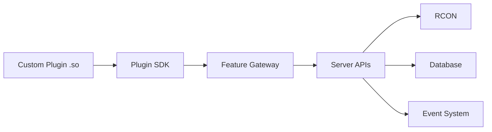

# Custom Plugins

Squad Aegis supports custom plugins built as Go `.so` files, allowing you to extend server functionality with your own code.

## Overview

Custom plugins enable you to:

- React to game events (kills, chats, admin actions)
- Execute RCON commands automatically
- Manage players and admins
- Integrate with external services
- Implement custom game logic
- Store and retrieve data

## Architecture



Custom plugins use a feature-based API system:

1. **Declare Features**: Specify what your plugin needs
2. **Request Permissions**: Declare required permissions
3. **Access APIs**: Use the feature gateway to access functionality
4. **Sandboxed Execution**: Plugins run with resource limits

## Getting Started

### Prerequisites

- Go 1.21 or later
- Squad Aegis source code (for SDK)
- Basic Go programming knowledge

### Creating Your First Plugin

1. **Create a new directory:**
   ```bash
   mkdir my-plugin
   cd my-plugin
   ```

2. **Initialize Go module:**
   ```go
   // go.mod
   module my-plugin
   
   go 1.21
   
   require go.codycody31.dev/squad-aegis v0.0.0
   
   replace go.codycody31.dev/squad-aegis => ../squad-aegis
   ```

3. **Create plugin.go:**
   ```go
   package main
   
   import (
       "go.codycody31.dev/squad-aegis/internal/plugin_sdk"
   )
   
   type MyPlugin struct {
       baseAPI plugin_sdk.BaseAPI
   }
   
   // Required: Export your plugin
   var PluginExport plugin_sdk.PluginSDK = &MyPlugin{}
   
   func (p *MyPlugin) GetManifest() plugin_sdk.PluginManifest {
       return plugin_sdk.PluginManifest{
           ID:          "my_plugin",
           Name:        "My Plugin",
           Version:     "1.0.0",
           Author:      "Your Name",
           SDKVersion:  plugin_sdk.APIVersion,
           Description: "My custom plugin",
           
           RequiredFeatures: []plugin_sdk.FeatureID{
               plugin_sdk.FeatureLogging,
           },
           
           RequiredPermissions: []plugin_sdk.PermissionID{},
       }
   }
   
   func (p *MyPlugin) Initialize(baseAPI plugin_sdk.BaseAPI) error {
       p.baseAPI = baseAPI
       
       // Get logging API
       logAPI, _ := baseAPI.GetFeatureAPI(plugin_sdk.FeatureLogging)
       log := logAPI.(plugin_sdk.LogAPI)
       log.Info("Plugin initialized!", nil)
       
       return nil
   }
   
   func (p *MyPlugin) Shutdown() error {
       return nil
   }
   ```

4. **Build the plugin:**
   ```bash
   go build -buildmode=plugin -o my-plugin.so plugin.go
   ```

## Plugin SDK Reference

### Core Interface

Every plugin must implement `plugin_sdk.PluginSDK`:

```go
type PluginSDK interface {
    GetManifest() PluginManifest
    Initialize(baseAPI BaseAPI) error
    Shutdown() error
}
```

### Manifest Structure

```go
type PluginManifest struct {
    // Required
    ID          string
    Name        string
    Version     string
    Author      string
    SDKVersion  string
    
    // Optional
    Description string
    Website     string
    
    // Capabilities
    RequiredFeatures       []FeatureID
    ProvidedFeatures       []FeatureID
    RequiredPermissions    []PermissionID
    AllowMultipleInstances bool
    LongRunning            bool
}
```

## Available Features

### Logging

```go
RequiredFeatures: []plugin_sdk.FeatureID{
    plugin_sdk.FeatureLogging,
}

// Usage
logAPI, _ := baseAPI.GetFeatureAPI(plugin_sdk.FeatureLogging)
log := logAPI.(plugin_sdk.LogAPI)

log.Info("Message", map[string]interface{}{
    "key": "value",
})
log.Warn("Warning", nil)
log.Error("Error", err, nil)
log.Debug("Debug", nil)
```

### Event Handling

```go
RequiredFeatures: []plugin_sdk.FeatureID{
    plugin_sdk.FeatureEventHandling,
}

// Implement HandleEvent
func (p *MyPlugin) HandleEvent(event *plugin_sdk.PluginEvent) error {
    log.Info("Received event", map[string]interface{}{
        "type": event.Type,
    })
    return nil
}
```

### RCON Commands

```go
RequiredFeatures: []plugin_sdk.FeatureID{
    plugin_sdk.FeatureRCON,
}

RequiredPermissions: []plugin_sdk.PermissionID{
    plugin_sdk.PermissionRCONAccess,
}

// Usage
rconAPI, _ := baseAPI.GetFeatureAPI(plugin_sdk.FeatureRCON)
rcon := rconAPI.(plugin_sdk.RconAPI)

rcon.Broadcast("Hello players!")
rcon.SendWarningToPlayer("76561198012345678", "Warning message")
rcon.KickPlayer("76561198012345678", "Reason")
```

### Server Information

```go
RequiredFeatures: []plugin_sdk.FeatureID{
    plugin_sdk.FeatureServerAPI,
}

// Usage
serverAPI, _ := baseAPI.GetFeatureAPI(plugin_sdk.FeatureServerAPI)
server := serverAPI.(plugin_sdk.ServerAPI)

info, _ := server.GetServerInfo()
players, _ := server.GetPlayers()
squads, _ := server.GetSquads()
```

### Database Access

```go
RequiredFeatures: []plugin_sdk.FeatureID{
    plugin_sdk.FeatureDatabaseAccess,
}

RequiredPermissions: []plugin_sdk.PermissionID{
    plugin_sdk.PermissionDatabaseRead,
}

// Usage
dbAPI, _ := baseAPI.GetFeatureAPI(plugin_sdk.FeatureDatabaseAccess)
db := dbAPI.(plugin_sdk.DatabaseAPI)

db.SetPluginData("key", "value")
value, _ := db.GetPluginData("key")
db.DeletePluginData("key")
```

## Permissions

Plugins must declare and be granted permissions:

| Permission | Description |
|------------|-------------|
| `rcon.access` | Send RCON commands |
| `rcon.broadcast` | Broadcast messages |
| `rcon.kick` | Kick players |
| `rcon.ban` | Ban players |
| `database.read` | Read database |
| `database.write` | Write database |
| `admin.management` | Manage admins |
| `player.management` | Manage players |
| `event.publish` | Publish events |
| `connector.access` | Use connectors |

## Resource Management

### Goroutines

Always use the base API to spawn goroutines:

```go
p.baseAPI.SpawnGoroutine(func() {
    // Your code
})
```

This enables sandbox tracking and limits.

### Context Handling

Use the plugin context for graceful shutdown:

```go
ctx := p.baseAPI.GetContext()

for {
    select {
    case <-ctx.Done():
        return // Plugin shutting down
    case <-time.After(time.Minute):
        // Do work
    }
}
```

### Resource Limits

Default sandbox limits:

- **Memory**: 512 MB
- **Goroutines**: 100
- **Timeout**: Configurable

Exceeding limits stops the plugin automatically.

## Building & Signing

### Build Plugin

```bash
go build -buildmode=plugin -o my-plugin.so plugin.go
```

### Generate Keys

```bash
# Generate ED25519 key pair
ssh-keygen -t ed25519 -f plugin_key
```

### Sign Plugin

```go
package main

import (
    "crypto/ed25519"
    "crypto/sha256"
    "encoding/base64"
    "os"
)

func main() {
    // Read plugin bytes
    pluginBytes, _ := os.ReadFile("my-plugin.so")
    
    // Read private key
    privateKey, _ := os.ReadFile("private.key")
    
    // Hash plugin
    hash := sha256.Sum256(pluginBytes)
    
    // Sign
    signature := ed25519.Sign(ed25519.PrivateKey(privateKey), hash[:])
    
    // Save signature
    os.WriteFile("my-plugin.so.sig", signature, 0644)
    
    // Print for manifest
    println("Signature (base64):", base64.StdEncoding.EncodeToString(signature))
}
```

## Uploading Plugins

1. **Upload Public Key** (Admin):
   - Navigate to Settings → Plugin Keys
   - Add your public key
   - Name it for identification

2. **Upload Plugin**:
   - Navigate to Plugins → Custom Plugins
   - Click "Upload Plugin"
   - Select `.so` file
   - Paste signature
   - Submit for review

3. **Grant Permissions** (Admin):
   - Review required permissions
   - Grant necessary permissions
   - Verify signature

4. **Enable Plugin**:
   - Enable on specific servers
   - Configure as needed
   - Monitor logs

## Best Practices

### Error Handling

```go
// Always check errors
logAPI, err := baseAPI.GetFeatureAPI(plugin_sdk.FeatureLogging)
if err != nil {
    return fmt.Errorf("failed to get logging API: %w", err)
}

// Type assertion with check
log, ok := logAPI.(plugin_sdk.LogAPI)
if !ok {
    return fmt.Errorf("logging API has incorrect type")
}
```

### Logging

```go
// Use structured logging
log.Info("Player joined", map[string]interface{}{
    "player_name": player.Name,
    "steam_id":    player.SteamID,
    "team_id":     player.TeamID,
})
```

### State Management

```go
type MyPlugin struct {
    baseAPI plugin_sdk.BaseAPI
    mu      sync.Mutex
    data    map[string]string
}

func (p *MyPlugin) UpdateData(key, value string) {
    p.mu.Lock()
    defer p.mu.Unlock()
    p.data[key] = value
}
```

### Testing

```go
// Create test helpers
func TestPlugin() {
    p := &MyPlugin{}
    
    // Mock base API
    mockAPI := &MockBaseAPI{}
    
    // Initialize
    if err := p.Initialize(mockAPI); err != nil {
        t.Errorf("Failed to initialize: %v", err)
    }
}
```

## Troubleshooting

### Plugin Won't Load

**Problem**: Plugin fails to load with "symbol not found"

**Solution**: Ensure `PluginExport` is defined:
```go
var PluginExport plugin_sdk.PluginSDK = &MyPlugin{}
```

### Permission Denied

**Problem**: API calls fail with permission errors

**Solution**: 
1. Declare permissions in manifest
2. Have admin grant permissions
3. Verify feature is declared

### Sandbox Violation

**Problem**: Plugin stops with "resource limit exceeded"

**Solution**:
1. Check goroutine count
2. Monitor memory usage
3. Fix resource leaks
4. Request higher limits if needed

### Type Assertion Fails

**Problem**: `API has incorrect type`

**Solution**:
```go
// Always check type assertions
if api, ok := rawAPI.(plugin_sdk.LogAPI); ok {
    // Use api
} else {
    return fmt.Errorf("incorrect type")
}
```

## Examples

See `examples/custom_plugin/` for a complete example with:

- Makefile for building
- Signing scripts
- Full documentation
- Best practices

## Security

### Signature Verification

All custom plugins must be signed:

1. Generate key pair
2. Sign plugin with private key
3. Upload public key to Squad Aegis
4. Include signature when uploading plugin

### Sandbox

Plugins run in a sandbox with:

- Memory limits
- Goroutine limits
- No direct filesystem access
- Permission-based API access

### Code Review

**Recommended**: Have plugins reviewed before deployment:

- Check for malicious code
- Verify resource usage
- Test thoroughly
- Monitor in production

## API Versioning

Plugins declare SDK version compatibility:

```go
SDKVersion: plugin_sdk.APIVersion, // Current: v1.0.0
```

- **Major version** changes may break plugins
- **Minor version** additions are backward compatible
- **Patch version** fixes are transparent

The system checks compatibility at load time.

## Support

- **Documentation**: https://squad-aegis.docs.com
- **Examples**: `examples/custom_plugin/`
- **Issues**: GitHub Issues
- **Community**: Discord Server

## Next Steps

1. [Build your first plugin](../examples/first-plugin)
2. [Explore API reference](../api/plugin-sdk)
3. [Review example plugins](../examples/overview)
4. [Deploy to production](../deployment/plugins)

